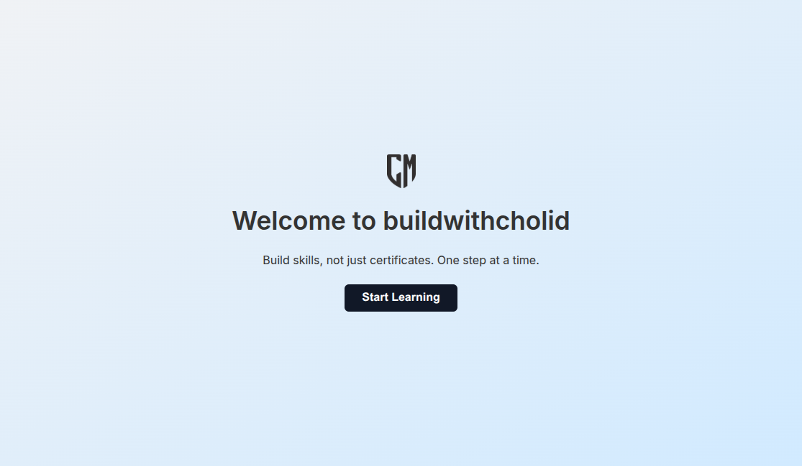

# 03 - Flex Alignment: Centered Hero Section

A simple responsive **hero section** layout built using **basic Flexbox alignment** — without media queries or frameworks.

 

## 🌟 Features

- `display: flex` with `justify-content` and `align-items` to center content
- Responsive vertical centering using `height: 100vh`
- Clean, structured layout with headline, subtext, and call-to-action button
- **Gradient background** using warm orange tones (`#fcd34d → #f59e0b`)
- Smooth hover effect for the CTA button
- Custom font from [Google Fonts (Inter)](https://fonts.google.com/specimen/Inter)

## 💡 What I Learned

- How Flexbox handles **vertical and horizontal alignment**
- How to build a minimal hero layout without extra containers
- Importance of spacing (`gap`) and typography in UI

## 🔗 Live Preview

[🌐 View Live on GitHub Pages](https://cholidmawardi.github.io/frontend-learning-journey/02-flexbox/03-flex-alignment/)

---

> ✅ Built manually as part of my self-directed Frontend Learning Journey.