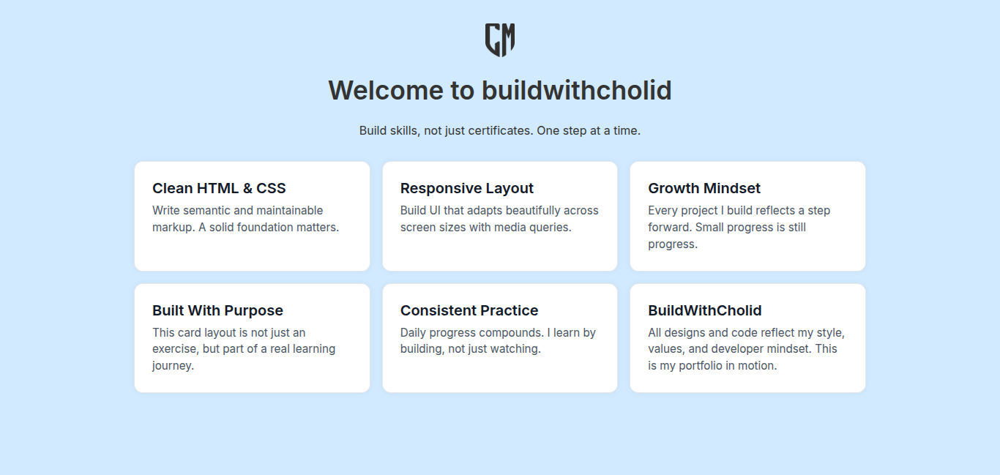

# 04 - Flex Wrap (Responsive Version)

A responsive and branded layout using `flex-wrap` and media queries.  
This version expands the previous layout by introducing real content, personal branding, and mobile-first responsiveness.

 

### 💡 Highlights
- Responsive grid layout using `flex-wrap`
- Mobile-friendly layout with media queries
- Custom color scheme and font
- Subtle hover interaction for cards
- Personal logo and tagline integration

> Part of the [frontend-learning-journey](https://github.com/cholidmawardi/frontend-learning-journey) — built with focus and clarity.

### 🔗 Live Preview

[See it live →](https://cholidmawardi.github.io/frontend-learning-journey/02-flexbox/04-flex-wrap/)

---

© 2025 Cholid Mawardi · BuildWithCholid