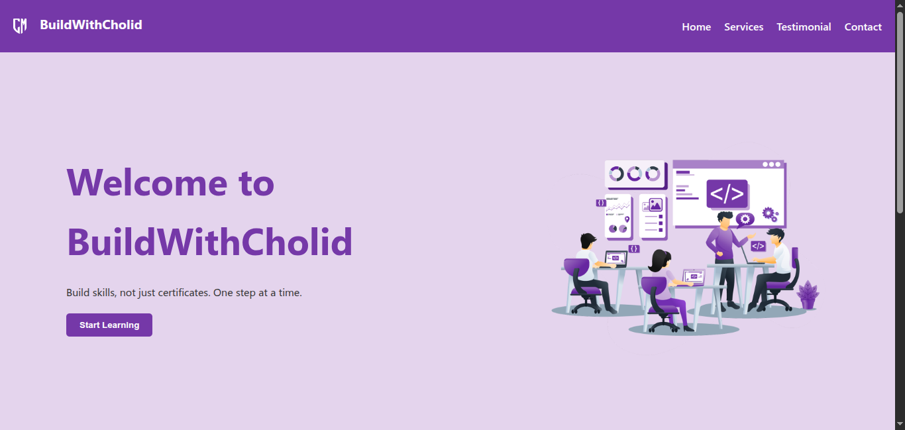

# 🌐 Grid & Flexbox Layout Project

This is a responsive landing page built as part of my frontend learning journey. It focuses on **combining CSS Grid and Flexbox**—two essential layout techniques in modern web development.

---

## 🎯 Purpose

The main goal of this project is to:

- Practice combining **CSS Grid** and **Flexbox** in one cohesive layout
- Build a fully responsive layout without using any framework
- Develop a realistic, portfolio-ready section structure (header, hero, features, testimonials, footer)
- Express my personal brand and developer identity through content and styling

---

## 🛠️ Built With

- **HTML5** – Semantic and accessible structure
- **CSS3** – Pure CSS with custom styling
  - `display: flex` for header, hero and footer alignment
  - `display: grid` for feature cards, and testimonials
- Responsive techniques with **media queries**
- Mobile-first mindset

---

## 💡 Layout Summary

| Section         | Layout Used | Description                                      |
|----------------|-------------|--------------------------------------------------|
| Header         | Flexbox     | Aligns logo and navigation menu horizontally     |
| Hero Section   | Flexbox | Split between intro text and image              |
| Features       | Grid        | Auto-fit feature cards in columns                |
| Testimonials   | Grid        | Adaptive layout for student feedback             |
| Footer         | Flexbox     | Multi-column layout with wrap on smaller screens |

---

## ✨ Personal Branding

This project includes personal branding elements such as:

- A custom project title and tagline: **BuildWithCholid**
- Original messaging and learning philosophy
- Personal tone in feature cards and testimonials
- Logo and consistent color theme reflecting my identity

This is not just a layout exercise, but also a personal showcase of how I think, build, and present myself as a developer.

---

## 📱 Responsive Design

The layout adapts from desktop to mobile using:

- `repeat(auto-fit, minmax(...))` for flexible grid columns
- `flex-wrap`, `gap`, and `media queries` for mobile layout
- `place-items` and `text-align` for centered content

---

## 🔍 Screenshot



---

## 📚 Learning Outcome

> This project is more than just a layout demo — it reflects how I structure real-world components using **native CSS tools** without relying on frameworks. It solidifies my understanding of how and when to use Grid vs Flexbox.

---

## 📂 Folder Structure

```
07-grid-flexbox-combination/
├── assets/
├── index.html
├── style.css
└── README.md
```

---

## 📌 Status

✅ Completed — ready for deployment or extension (e.g., dark mode, animation)


## Live Preview

[View Demo](https://cholidmawardi.github.io/frontend-learning-journey/03-grid/07-grid-flexbox-combination/)